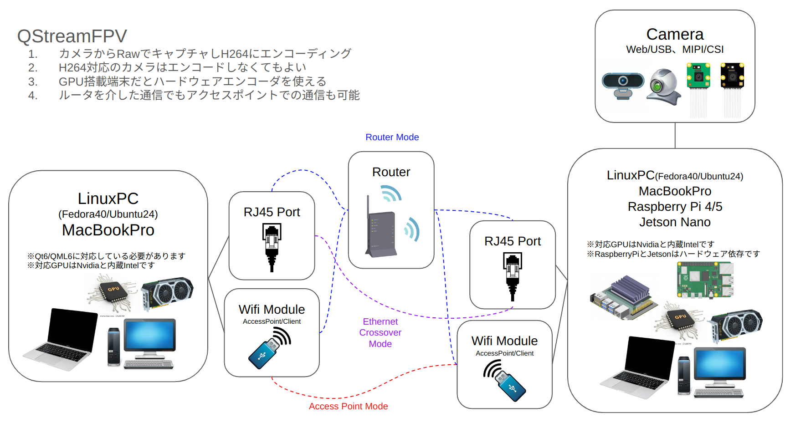
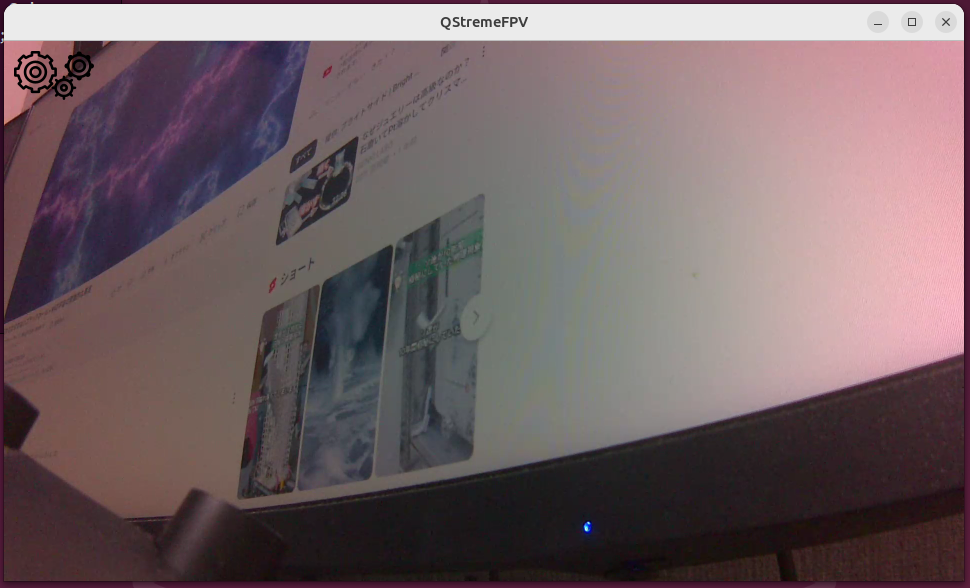
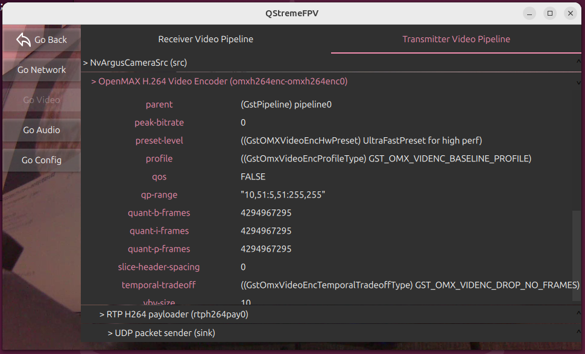

# QStreamFPV
Example Qt6 Applicatine with GStreamer



# 概要

このアプリケーションはGStreamerを使って映像や音声をストリーミングすることができます。  
1対1のUnicastを想定しており、BroadcastやMulticastなどは想定していません。  
ReceiverとTransmitterに分かれており、QtCreatorを使って作成しました。  

Receiverは下記のマシンで動作させることができます。
* Fedora40
* Ubuntu24.04
* MacBookPro

gst-plugins-goodのqml6glsinkを使っているため、Qt6/Qml6がサポートされていてGStreamerのVerが1.22以上である必要があります。  

ハードウェアデコードを利用するにはGPUが必要です。  
NividiaのグラフィックボードとIntelの内蔵GPUをサポートしています。  
GPU利用しない場合はソフトウェアデコードが利用できます。  

Transmitterがサポートしているものは下記の端末です。
* Fedora40
* Ubuntu24.04
* MacBookPro
* Jetson Nano
* Raspberry Pi 4/5

ハードウェアエンコードを利用するにはGPUが必要です。  
NividiaのグラフィックボードとIntelの内蔵GPUをサポートしています。  
GPU利用しない場合はソフトウェアエンコードが利用できます。  
Jetson NanoとRaspberry Pi 4はハードウェアエンコードを利用します。  
Raspberry Pi 5ハードウェアエンコードがサポートされていないためソフトウェアエンコードのみとなります。  
CPU温度に注意してください。  


# ビルド
## Linux
必要となるものは、QtCreatorとGStreamerです。
* Fedora
```bash
sudo dnf install qtcreator
sudo dnf install gstreamer1.0-* libgstreamer*
```
* Ubuntu
```bash
sudo apt install qtcreator
sudo apt install gstreamer1.0-* libgstreamer*
```
その他に必要となるライブラリがありますが、依存関係がよくわからないのでまとめてインストールします。
```bash
# Fedora
sudo dnf install qt6-* libqt6*
sudo dnf install qml-* qml6-* qtquick*
# Ubuntu
sudo apt install qt6-* libqt6*
sudo apt install qml-* qml6-* qtquick*
```
アクセスポイントモードを利用する場合はhostapdとdnsmasqが必要です。
```bash
# Fedora
sudo dnf install -y hostapd dnsmasq
# Ubuntu
sudo apt-get update
sudo apt-get install -y hostapd dnsmasq
```
## Mac
* MacbookPro
```bash
brew install qt-creator
brew install gstreamer
```

Macのgst-plugins-goodパッケージにはqml6glsinkが含まれていないため自分でビルドしてインストールする必要があります。  
[こちら](https://qiita.com/hexaforce/items/c8a409d40dee38d6834a)を参照してください

# 設定
設定は下記にまとめてあります。  
[settings_manager.cpp](QStreamFPV/utility/settings_manager.cpp)


### ネットワークの設定
* RouterMode  
```cpp
  // Network Mode
  defaultValues["network/mode"] = "RouterMode"; 
  defaultValues["receiver/ip_address"] = "192.168.1.1";
  defaultValues["transmitter/ip_address"] = "192.168.1.2";
```
ルータを介して接続する方法です。  
ReceiverとTransmitterのIPアドレスが必要になります。

* AccessPointMode  
```cpp
  // Network Mode
  defaultValues["wifi/ssid"] = "QStreamFPV";
  defaultValues["wifi/passphrase"] = "QStreamFPV";
  defaultValues["wifi/access_point"] = "Receiver"; // Receiver or Transmitter
  defaultValues["wifi/access_point_ip_address"] = "10.10.10.10";
  defaultValues["wifi/start_dhcp_range"] = "10.10.10.11";
  defaultValues["wifi/end_dhcp_range"] = "10.10.10.100";
  defaultValues["wifi/subnet_mask"] = "255.192.0.0"; // /10
  defaultValues["wifi/dnsmasq_port"] = 1053;
  defaultValues["receiver/network_interface"] = "wlan0";
  defaultValues["transmitter/network_interface"] = "wlan0";
```
hostapdとdnsmasqを使ってReceiverとTransmitterをWifi接続します。  
ReceiverとTransmitterのインターフェース名が必要になります。    
ReceiverかTransmitterのどちらかをアクセスポイントとして接続します。  
hostapdの設定も修正する必要があります。  
[hostapd.conf](QStreamFPV/wifi/hostapd.conf)
Wifiは5Ghz(48ch)を使用するようになっています。  
2.4Ghzを使用する場合はチャンネルを変更してください。  

### コーデックの設定
* Video Codec
```cpp
  // Video Codec
  defaultValues["receiver/video_codec"] = "H264";    // H264 or H265
  defaultValues["transmitter/video_codec"] = "H264"; // H264 or H265
```
動画のコーデックを指定します。  
H264かH265が利用できます。  

### GPUの設定
* GPU Support
```cpp
  // GPU Support
  defaultValues["receiver/gpu_support"] = "None";    // None or Nvidia or Intel
  defaultValues["transmitter/gpu_support"] = "None"; // None or Nvidia or Intel
```
エンコード/デコードでGPUを使用するかどうかを設定します。  
GPUはLinux(Fedora/Ubuntu)の時に有効になります。  
Noneを使用するとソフトウェはエンコード/デコードになります。  
Macbookはハードウェアエンコードのため高速です。  
下記にGStreamerで使用するエンコーダとデコーダを記します。

## Transmitter
|                   | H264 Encoder |  H265 Encoder | H264 Encoder(HW) | H264 Encoder(HW) |
|-------------------|:------------:|:-------------:|:----------------:|:----------------:|
| Linux(GPU:None)   |  openh264enc | not supported |        ー        |        ー        |
| Linux(GPU:Nvidia) |      ー      |       ー      |   nvv4l2h264enc  |   nvv4l2h265enc  |
| Linux(GPU:Intel)  |      ー      |       ー      |   vaapih264enc   |   vaapih265enc   |
| MacbookPro        |      ー      |       ー      |   vtenc_h264_hw  |   vtenc_h265_hw  |
| Jetson            |      ー      |       ー      |    omxh264enc    |    omxh265enc    |
| raspberrypi4      |      ー      |       ー      |    v4l2h264enc   |    v4l2h265enc   |
| raspberrypi5      |  openh264enc | not supported |        ー        |        ー        |
## Receiver
|                   | H264 Encoder |  H265 Encoder | H264 Encoder(HW) | H265 Encoder(HW) |
|-------------------|:------------:|:-------------:|:----------------:|:----------------:|
| Linux(GPU:None)   |  openh264dec | not supported |        ー        |        ー        |
| Linux(GPU:Nvidia) |      ー      |       ー      |   nvv4l2decoder  |   nvv4l2decoder  |
| Linux(GPU:Intel)  |      ー      |       ー      |   vaapih264dec   |   vaapih265dec   |
| MacbookPro        |      ー      |       ー      |     vtdec_hw     |     vtdec_hw     |
### 音声ストリーミングの設定
```cpp
  // Transmitter Audio
  defaultValues["transmitter/enable_audio"] = true;
```
音声のストリーミングを有効にします。  
音声コーデックはOpusを使用します。

# 実行
QtCreatorでビルド＆実行できます。  
基本的にはqmakeでビルドするとバイナリができるので実行するだけです。
## Jetson/RaspberryPi
```bash
cd QStreamFPV
sudo apt install gstreamer1.0-* libgstreamer*
sudo apt install qt6-* libqt6*
sudo apt install qml-* qml6-* qtquick*
qmake
make
./QStreamFPV/Transmitter
```


